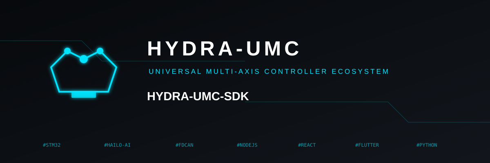
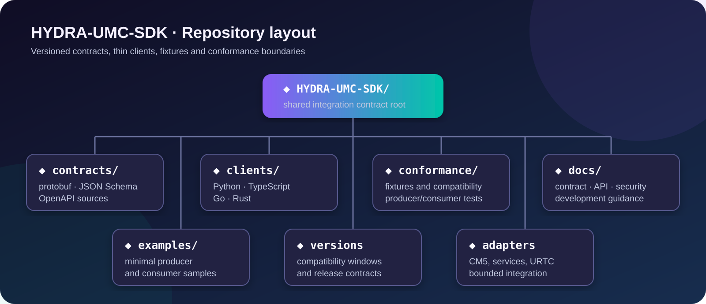

<!--
=====================================================================
HYDRA-UMC-SDK - 公的契約および統合ツールキットの概要
Copyright (C) 2026 JuanenRac (エレクトロホビー 3D) <electrohobby3d@gmail.com>
CC BY-SA 4.0 - LICENSE.md を参照
=====================================================================
-->

  

  <a href="README.md">???? English</a> |
  <a href="README_spa.md">🇪🇸スペイン語</a> |
  <a href="README_fra.md">🇫🇷 フランス語</a> |
  <a href="README_ita.md">🇮🇹 イタリアーノ</a> |
  <a href="README_deu.md">🇩🇪 ドイツ語</a> |
  <a href="README_zho.md">🇨🇳 简体中文</a> |
  <a href="README_jpn.md">🇯🇵 日本語</a>

  
  
  
  

# ヒドラ-UMC-SDK

## 🧩 HYDRA-UMC の共有コントラクトと統合ツールキット

HYDRA-UMC-SDK は、HYDRA-UMC サービスによって共有される安定した言語を定義します。
クライアント、CM5 アダプター、および URTC 統合。規範的な契約を所有しています。
依存関係のない Python 参照バリデータ、適合フィクスチャ、
統合ガイダンス。そうではありません
Raspberry Pi OS、Hailo、ROS 2、MQTT、OPC-UA、または
MTコネクト。

## 🚧 ステータス

JSON スキーマ v1 コントラクト、有効/無効なフィクスチャ、Python 検証クライアント、
ホスト側のテストが実装されます。 Protobuf/OpenAPI パブリケーションとクライアント
さらなる言語については、その後の互換性マイルストーンになります。

実際に動作する自動互換性マトリクス（`tools/verify_contract_matrix.py`）は、公開されているすべてのスキーマを Python バリデータ自身のコントラクト一覧と突き合わせて検証します。これにより、`project-manifest.schema.json`（このエコシステムの各リポジトリが公開する `hydra-umc.project.json` のコントラクト）にバリデータのエントリが一つも存在しないという実際のギャップを発見し、修正しました。現在では、各適合フィクスチャがそのファイル名どおりに判定されること、さらに未知のコントラクトおよび非互換なスキーマバージョンのケースについても正しく判定されることを証明しています。

## 🎯 最初のマイルストーン

1. `DeviceDescriptor`、`HealthReport`、`SafetyState`、および
   「UpdateManifest」JSON スキーマ v1。
2. Python リファレンス クライアントを使用して、有効なフィクスチャと無効なフィクスチャを検証します。
3. CI にプロデューサー/コンシューマー互換性マトリックスを追加します。
4. 統合で必要な場合は、Protobuf/OpenAPI 表現を公開します。
5. 安定した契約から TypeScript、Go、および Rust クライアントを追加します。

## 📂 リポジトリのレイアウト

  

|パス |目的 |
| --- | --- |
| `契約/` |標準的な JSON スキーマ v1 ソース。さらなる代表は安定した契約に従います。 |
| `クライアント/` |依存関係のない Python リファレンス検証ツールと将来の言語クライアント。 |
| `適合/` |互換性テストで使用される有効な v1 フィクスチャと無効な v1 フィクスチャ。 |
| `docs/` |契約、API、セキュリティ、開発仕様。 |
| `例/` |実行可能な Python 検証の例。 |

新しいメッセージを定義する前に、[契約ガイド](docs/CONTRACTS.md) をお読みください。

## 🔗 関連プロジェクト

> 正規の公開エコシステム関係マップ。

|プロジェクト | HYDRA-UMC-SDKとの関係 |
| --- | --- |
| [HYDRA-UMC-OS](https://github.com/JuanenRac/HYDRA-UMC-OS) |デバイス、健康、安全、および更新契約のデバイス エージェント コンシューマ。 |
| [HYDRA-UMC-SERVER](https://github.com/JuanenRac/HYDRA-UMC-SERVER) | SDK 契約によって管理される認証された API プロデューサーとコンシューマー。 |
| [HYDRA-UMC-UPDATER](https://github.com/JuanenRac/HYDRA-UMC-UPDATER) |契約を認識するクライアントが使用するバージョンと互換性のメタデータを公開します。 |
| [HYDRA-UMC](https://github.com/JuanenRac/HYDRA-UMC) |ハードウェア/ファームウェア プラットフォームは、制限された CM5 および MCU アダプター コントラクトを通じて公開されます。 |
| [URTC](https://github.com/JuanenRac/URTC) |バージョン管理された統合アダプターを介して接続された独立したツールコントローラー プラットフォーム。 |
| [HYDRA-UMC-BRIDGE-ROS2](https://github.com/JuanenRac/HYDRA-UMC-BRIDGE-ROS2) | 共通 BridgeJob ゲートを ROS 2 の観測、検査、キャンセル可能なセル作業に使用します。 |
| [HYDRA-UMC-BRIDGE-OPENPNP](https://github.com/JuanenRac/HYDRA-UMC-BRIDGE-OPENPNP) | 追跡可能な PCB 受け渡しに、相関付けられた冪等ジョブを使用します。 |
| [HYDRA-UMC-BRIDGE-PRINTER3D](https://github.com/JuanenRac/HYDRA-UMC-BRIDGE-PRINTER3D) | ネイティブプリンターの準備状態の周囲でゲートを使用し、加熱または動作制御を公開しません。 |
| [HYDRA-UMC-BRIDGE-CNC](https://github.com/JuanenRac/HYDRA-UMC-BRIDGE-CNC) | アイドルで保護された CNC の隣でのみゲートを使用します。 |
| [HYDRA-UMC-BRIDGE-LASER](https://github.com/JuanenRac/HYDRA-UMC-BRIDGE-LASER) | レーザー安全権限を維持しつつ、補助作業にゲートを使用します。 |

**残りのエコシステム:** [JuanenRac エコシステム ダッシュボード](https://juanenrac.github.io/JuanenRac/) で 7 つのパブリック レイヤーを調べてください。

## 📜ライセンス

コードは GPL-3.0 以降です。ドキュメントは CC BY-SA 4.0 です。 [ライセンス](LICENSE)を参照してください。

## 🛠️ BUILD & RUN

リリースビルドの前に、バージョンを変更しないビルドチェックを使用してください。

| 操作 | Windows | Linux / macOS |
|---|---|---|
| ビルドチェック（バージョンと CHANGELOG を変更しない） | `build-test.bat` | `./build-test.sh` |
| 実行 / 開発（提供されている場合） | `run*.bat` または `dev*.bat` | `./run*.sh` または `./dev*.sh` |

`build-test.bat` と `build-test.sh` は、`hydra-umc.project.json` をインクリメントせず、`CHANGELOG.md` も変更せずにプロジェクトのスタックをコンパイルまたは検証します。通常のコンパイラ出力だけが作成される場合があります。既存の `build*.bat`、`build*.sh`、`run*`、`dev*` は、各プロジェクト固有のバージョン化または実行時の動作を維持します。その動作が必要な場合はそれらを使用してください。
